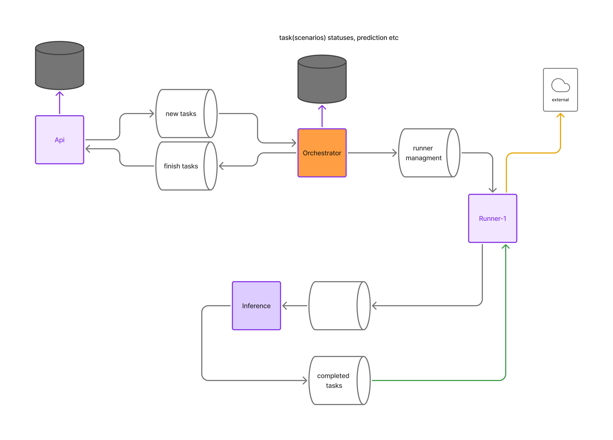

# Распределенная видеоаналитика

### Запуск

```
docker compose up --build
```

### Структура
```
project/
├── orchestrator/
│   ├── orchestrator.py
│   ├── models.py
│   ├── Dockerfile
|   └── requirements.txt
├── api/
│   ├── main.py
│   ├── Dockerfile
|   └── requirements.txt
├── inference/
│   ├── inference_service.py
│   ├── model.py
│   ├── Dockerfile
|   └── requirements.txt
├── runner/
│   ├── runner.py
│   ├── Dockerfile
|   └── requirements.txt
└── docker-compose.yml
```

### Chart


